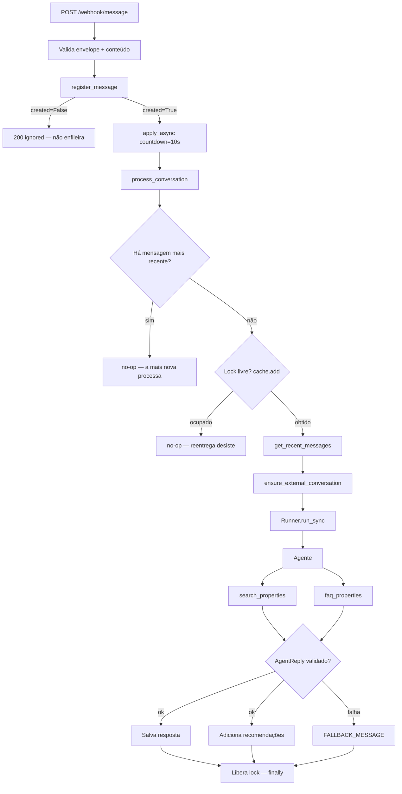
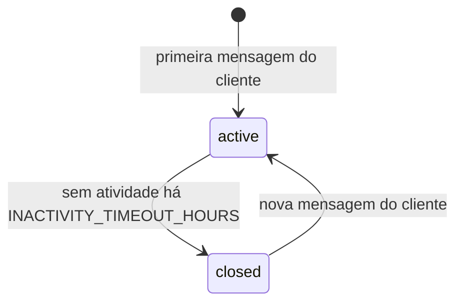

# ARCHITECTURE.md

Decisões técnicas do backend do assistente de IA da Realmate. Formato: decisão,
motivo e, quando houve, a alternativa descartada.

---

## 1. Arquitetura empregada

Monolito modular em Django: apps por domínio, camadas explícitas dentro de cada
app. Sem hexagonal, DDD literal ou microserviços — o domínio é pequeno, e a
evolução prevista (novas fontes de imóveis, novas tools) já cabe nos pontos de
extensão existentes.

| Componente  | Escolha                | Motivo                                                              |
| ----------- | ---------------------- | ------------------------------------------------------------------- |
| API         | Django + DRF           | ORM, migrations e constraints prontos; o desafio é de domínio        |
| Assíncrono  | Celery + Redis         | a resposta da IA leva segundos e pode falhar — não cabe no request   |
| Banco       | PostgreSQL             | as constraints são a base da idempotência, não um detalhe            |
| Cache/lock  | Redis                  | `cache.add` é atômico: lock sem infra nova                           |
| IA          | OpenAI Agents SDK      | tools tipadas pela assinatura e saída validada por Pydantic          |

Redis acumula três papéis — broker, result backend e cache/lock. Um serviço a
menos para operar.

---

## 2. Organização do código

### 2.1 Apps

| App             | Responsabilidade                                          | Não faz                          |
| --------------- | --------------------------------------------------------- | -------------------------------- |
| `webhooks`      | transporte: valida o payload, delega, responde rápido     | regra de negócio, IA             |
| `conversations` | domínio da conversa: modelos, serviços, task orquestradora | parsing do contrato do provedor  |
| `assistant`     | camada de IA: agente, prompt, tools, tradução do histórico | decidir fluxo, gravar conversa   |
| `properties`    | imóveis e ETL de carga                                     | conhecer conversa                |
| `common`        | transversal real (`TimestampedModel`, validators)          | qualquer regra de domínio        |

`webhooks` é separado de `conversations` porque muda por outro motivo: o
contrato do provedor de mensageria de um lado, o domínio da conversa do outro.

### 2.2 Camadas

| Camada     | Arquivo          | Papel                                                             |
| ---------- | ---------------- | ----------------------------------------------------------------- |
| View       | `views.py`       | valida entrada, delega, responde — sem `if` de negócio            |
| Task       | `tasks.py`       | orquestra (lock, supersessão, agente, persistência) — não decide  |
| Service    | `services.py`    | onde a regra de negócio vive                                      |
| Model      | `models.py`      | forma dos dados e constraints                                     |
| Serializer | `serializers.py` | contrato HTTP de entrada e saída                                  |

Direção das dependências: `view → service`, `task → service`, `service → model`.
Nenhum service importa view ou task, e `assistant` não conhece view nem webhook.

O critério prático: **regra que precisa valer em mais de um caminho de entrada
só pode morar no service.** Encerramento e reabertura de conversa chegam pelo
beat e pelo webhook — por isso são `close_inactive_conversations` e
`reopen_if_closed` em `conversations/services.py`, e a task só decide quando
chamar.

Testes ficam em `tests/` por app; as fixtures compartilhadas, em `src/conftest.py`.

### 2.3 Modelagem

- **`Property`, uma tabela para todas as fontes.** `code` é `unique` — chave de
  negócio (o cliente cita no WhatsApp, o ETL usa no upsert) —, mas a PK continua
  `BigAutoField`: chave de negócio como PK amarra o banco a um identificador de
  terceiros. `transaction_type` usa o vocabulário do cliente (`"aluguel"` /
  `"venda"`): mesmo termo no chat, na tool e no filtro do ORM.
- **`PropertyRecommendation` é `through` explícita**, não M2M simples: o
  `UniqueConstraint(conversation, property)` transforma "nunca recomendar o
  mesmo imóvel duas vezes" em garantia do banco, e o `created_at` dá a ordem de
  `properties_found`.
- **`Message.timestamp` × `created_at`.** `timestamp` é o horário da origem e
  ordena o histórico exposto pela API; `created_at` é o do `INSERT` e é o que
  mede inatividade. 
- **`last_message_at`**: mensagem atrasada
  não rebobina a conversa.

---

## 3. Fluxo de execução



1. **Webhook** valida, persiste e responde `200`. Reentrega devolve `"ignored"`
   e não enfileira nada.
2. **Debounce** de 10s antes de processar.
3. Passado o debounce, a task confere se há **mensagem mais recente** na
   conversa — havendo, descarta (é a task da mensagem mais nova quem processa).
4. Sem mensagem mais nova, tenta o **lock**: ocupado, a reentrega desiste;
   obtido, monta o pendente (`get_recent_messages`) e garante a conversa no
   provider (`ensure_external_conversation`).
5. **Agente** escolhe as tools; a saída volta validada como `AgentReply`.
6. Sucesso: persistência da resposta e das recomendações. **Falha em qualquer
   ponto do run vira `FALLBACK_MESSAGE`** — a task não propaga o erro, porque
   propagar faria o Celery reenfileirar e cobrar a IA de novo.
7. **Lock liberado no `finally`**, sucesso ou falha.

O cliente consulta a resposta via `GET /api/conversations/{user_phone}/messages`
de forma assíncrona, fora dessa cadeia — não há passo do processamento que
dependa dessa chamada nem a dispare.

Nada que dependa de rede externa acontece no request. A chamada ao LLM leva
segundos e pode falhar; fazê-la na thread do request transformaria latência em
reentrega do provedor, logo em processamento duplicado. Abrir a conversa no
provider também é rede, e por isso mora na task.

**Histórico no provider, pendências no banco.** `external_conversation_id`
aponta para a conversa na Conversations API, e cada run é anexado a ela, então o
modelo enxerga o que já foi dito sem reenvio. `get_recent_messages` manda apenas
o que o assistente ainda não respondeu — o custo por mensagem não cresce com o
tamanho da conversa. O banco continua sendo a fonte de verdade: o provider é
cache de contexto, não sistema de registro.

**Celery Beat**

| Job                                          | Frequência       | O que faz                                       |
| --------------------------------------------- | ---------------- | ----------------------------------------------- |
| `properties.load_properties`                  | diário, 00:00 UTC | ETL de imóveis (CSV + JSON)                     |
| `conversations.expire_inactive_conversations` | a cada 15 minutos | encerra atendimentos parados               |

---

## 4. Início e fim de conversa



**Início.** `Conversation` nasce `active` no primeiro `register_message`
(`get_or_create` por `user_phone`). A conversa no provider é aberta
preguiçosamente na primeira task, não na ingestão: o webhook precisa aceitar a
mensagem mesmo com o provider fora do ar.

**Fim.** O beat varre e `close_inactive_conversations` marca `closed` e grava a
`CLOSING_MESSAGE` — sumir calado deixaria o cliente esperando resposta.

- **O relógio é `Max(messages.created_at)`**, o horário do nosso `INSERT`. Não
  `last_message_at`: ele carrega o `timestamp` do provedor, que pode vir
  repetido e ficar congelado no passado enquanto o cliente digita. Não
  `updated_at`: só muda quando o timestamp avança.
- **Conversa que nunca recebeu mensagem** envelhece pelo próprio `created_at`;
  sem esse ramo ficaria ativa para sempre.
- **A `CLOSING_MESSAGE` é gravada direto no model**, não por `register_message`:
  não é atividade do atendimento, então não move `last_message_at` nem reabre a
  conversa que acabou de ser fechada.

**Reabertura.** Mensagem nova do cliente em conversa `closed` volta o status
para `active` e zera `external_conversation_id` — é esse `NULL` que faz o
próximo run abrir uma thread nova no provider, em vez de atender em cima de um
contexto encerrado. Só papel `customer` reabre (senão a própria mensagem de
encerramento reabriria); reentrega não reabre. O corte do histórico sai de
graça: `get_recent_messages` parte da última mensagem do assistente, que é
justamente a de encerramento.

---

## 5. Debounce

Requisito: mensagens em até 10s na mesma conversa geram **um** processamento.

```python
# a cada mensagem recebida
process_conversation.apply_async(..., countdown=settings.DEBOUNCE_WINDOW_SECONDS)

# 10s depois, ao executar
if has_newer_customer_message(conversation_id=..., message_id=trigger_id):
    return  # a task da mensagem mais recente é que responde
```

Três mensagens rápidas agendam três tasks: as duas primeiras veem mensagem mais
nova e retornam; a terceira processa e, como nenhuma resposta entrou no meio, as
três vão juntas ao modelo. Uma resposta.

**Custo aceito:** N tasks para N mensagens, N-1 no-ops. São `EXISTS` com índice,
e o volume de rajada é o de um humano digitando.

---

## 6. Idempotência

Nenhum dos pontos depende de um `if` em Python antes do `INSERT`: a garantia vem
sempre do banco ou de uma operação atômica.

| Ponto                  | Mecanismo                                          | Efeito                                                   |
| ----------------------- | --------------------------------------------------- | ---------------------------------------------------------- |
| Ingestão da mensagem    | `external_id` `unique` + `get_or_create`           | reentrega responde `"ignored"` e não dispara a IA         |
| Conversa                | `user_phone` `unique` + `get_or_create`            | mensagens simultâneas não criam duas conversas            |
| Execução da task        | `cache.add(lock, ttl=15s)`, liberado no `finally`  | reentrega do broker desiste                               |
| Recomendação            | `UniqueConstraint(conversation, property)`         | o mesmo imóvel não entra duas vezes na conversa           |
| Carga de imóveis        | `update_or_create(code=...)`                       | recarga atualiza (preço muda), nunca duplica              |

---

## 7. Regras determinísticas do assistente

Princípio: **regra verificável vive no código, não no prompt.** Prompt
influencia; código garante.

- **Filtros obrigatórios.** Sem `code`, faltando tipo de transação, bairro ou um
  filtro de preço, `search_properties` devolve **zero imóveis** e um `guidance`
  dizendo o que perguntar. Nem reformulação de prompt nem alucinação contornam.
- **`MAX_RESULTS = 2`** é fatiamento de queryset, não pedido no prompt.
- **Exclusão do já recomendado** (`.exclude(id__in=...)`) em toda busca,
  inclusive por código: o modelo não repete um imóvel porque nunca o vê.
- **`MAX_SEARCHES_PER_RUN = 3`**, contado em `AssistantDeps.searches_done`. Ao
  estourar, a tool degrada (`SEARCH_BUDGET_SPENT`) em vez de falhar.
- **`conversation_id` vem do `RunContextWrapper`, nunca do modelo** — como
  parâmetro de tool, um id alucinado leria a recomendação de outro cliente.
- **`guidance` junto do resultado:** a instrução do system prompt está longe, no
  início do contexto; a orientação chega no momento da decisão.
- **FAQ inteiro no contexto** (10 entradas, `@lru_cache`, validado por
  `FaqEntry`): zero infra de busca e nenhum falso negativo.
- **Saída validada** (`output_type=AgentReply`): o que o LLM devolve só vira
  registro depois de passar pelo Pydantic.

---

## 8. ETL de imóveis

- **Template Method.** `PropertyImporter` (ABC): `extract` e `transform` variam
  por formato; `load` — upsert por `code`, contagem, coleta de erros — é
  `@final`, para que um importador novo não reimplemente a idempotência da carga.
- **Fronteira tipada.** `extract` devolve `Any` (dado externo não confiável);
  `transform` devolve `PropertyData` (Pydantic) — o ponto em que vira domínio.
- **Tolerância a erro.** Parser levanta `ValueError`, `load` registra em
  `errors`, incrementa `skipped` e segue: um imóvel malformado não derruba a
  carga. `import_all_properties` isola as fontes entre si.
- **Ponto único de registro.** `active_importers()` é a única lista de fontes
  ativas; task e management command chamam a mesma função.
- **Extensão provada.** `etl/xml.py` e `etl/api_rest.py` são esqueletos com as
  assinaturas corretas: adicionar fonte não toca em `base.py`.
- Tasks registradas por `name=` explícito: mover o módulo não quebra o
  agendamento em silêncio.

---

## 9. Trade-offs assumidos

| Decisão                               | Ganho                                     | Custo aceito                                  |
| -------------------------------------- | ------------------------------------------ | ----------------------------------------------- |
| Uma tabela para todos os imóveis      | busca simples e rápida                    | campo específico de fonte não tem onde morar  |
| FAQ inteiro no contexto               | zero infra, sem falso negativo            | não escala além de ~centenas de entradas      |
| Fallback em vez de propagar erro      | cliente sempre recebe resposta            | falha do modelo só aparece em log             |
| Reabertura descarta a thread anterior | atendimento novo começa limpo             | contexto da conversa anterior não volta       |
| N tasks para N mensagens (debounce)   | rajada vira uma resposta só               | N-1 execuções no-op                           |