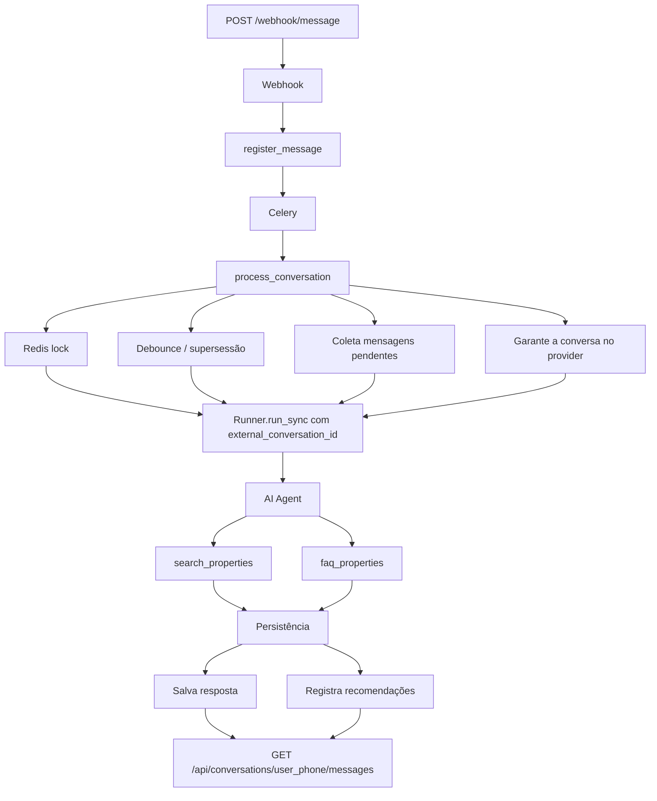

# ARCHITECTURE.md

Documento de decisões técnicas do backend do assistente de IA da Realmate.
O foco é **por que** o sistema está organizado assim — o que o código faz, o
código já conta.

---

## 1. Fluxo de execução

### Fluxo de processamento das mensagens



Em paralelo, o **Celery Beat** roda `properties.load_properties` diariamente às
00:00 UTC, executando o ETL de imóveis (CSV + JSON).

O webhook faz apenas trabalho síncrono barato (validar, `INSERT` e enfileirar)
e responde `200` imediatamente. Nada que dependa de rede externa acontece no
request: a chamada ao LLM leva segundos e pode falhar, e fazê-la na thread do
request transformaria latência do modelo em reentrega pelo provedor, o que
geraria processamento duplicado. Abrir a conversa no provider também é rede, e
por isso mora na task.

### Apps

| App             | Responsabilidade                                              |
| --------------- | ------------------------------------------------------------- |
| `webhooks`      | Transporte: validação do payload e resposta rápida            |
| `conversations` | Domínio da conversa: modelos, serviços, task de orquestração  |
| `assistant`     | Camada de IA: agente, prompt, tools, tradução de histórico    |
| `properties`    | Imóveis e o ETL de carga                                      |
| `common`        | O que é genuinamente transversal (`TimestampedModel`, validators) |

`webhooks` é separado de `conversations` porque são eixos de mudança
diferentes: o contrato do provedor de mensageria muda por um motivo, o domínio
da conversa por outro.

---

## 2. Decisões técnicas

**Celery + Redis para o processamento.** A resposta da IA é assíncrona por
requisito e por necessidade. Redis acumula três papéis: broker, result backend
e cache (usado como lock).

**Uma tabela para todos os imóveis.** CSV e JSON são mesclados em `Property`.
`code` é `unique` — é a chave de negócio (o cliente cita no WhatsApp, o ETL usa
como chave de upsert), mas a PK continua sendo o `BigAutoField`: chave de
negócio como PK amarraria o banco a um identificador controlado por terceiros.
`transaction_type` usa os termos do cliente (`"aluguel"` / `"venda"`), mesmo
vocabulário no cliente, na tool e no filtro do ORM.

**`PropertyRecommendation` é uma tabela `through` explícita**, não um M2M
simples: o `UniqueConstraint(conversation, property)` transforma "nunca
recomendar o mesmo imóvel duas vezes" numa garantia do banco; o `created_at` dá
a ordem de `properties_found` — recomendação feita é registro histórico.

**`timestamp` separado de `created_at`.** `timestamp` é o momento informado pela
origem (ordena o histórico); `created_at` é o do `INSERT`.

**`last_message_at`**, com `touch_last_message_at` que só avança,
nunca retrocede — mensagem atrasada não "rebobina" a conversa.

**Agents SDK da OpenAI (`agents`), não framework de orquestração.** O agente é
montado por request em `get_agent()`: mantém `settings` mutável nos testes e
evita estado compartilhado no worker. `output_type=AgentReply` (modelo Pydantic)
faz a saída do LLM ser validada antes de virar registro no banco, e o schema das
tools é derivado da assinatura das funções — não há dict de schema escrito à mão
para divergir.

**Histórico no provider, pendências no banco.** `Conversation` guarda um
`external_conversation_id` — a conversa criada na Conversations API da OpenAI.
Cada run é anexado a ela (`Runner.run_sync(..., conversation_id=...)`), então o
modelo enxerga o que já foi dito sem que a task reenvie o histórico a cada
mensagem.

`ensure_external_conversation` abre essa conversa de forma preguiçosa, no
primeiro processamento, e não na ingestão: o webhook precisa responder rápido e
aceitar a mensagem mesmo com o provider fora do ar. A chamada acontece dentro do
mesmo `try` do run, então uma indisponibilidade vira `FALLBACK_MESSAGE` como
qualquer outra falha de IA. A gravação é um `UPDATE` condicionado a
`external_conversation_id__isnull=True`: duas tasks concorrentes da mesma
conversa convergem para um único id, sem checagem em Python.

O que a task envia é só o que o assistente ainda não respondeu:
`get_recent_messages` acha a última mensagem do assistente e devolve as
mensagens do cliente posteriores a ela (ou a conversa inteira, se ainda não
houve resposta). Isso substitui o antigo teto de 30 mensagens por rodada — o
custo por mensagem deixa de crescer com o tamanho da conversa, e a rajada do
debounce chega junta ao modelo, que é exatamente o recorte que interessa.

O banco continua sendo a fonte de verdade do domínio: `Message` guarda papel,
conteúdo e timestamp, e `assistant/helpers.to_model_messages` traduz para o
formato do SDK na hora do envio. O provider é cache de contexto, não sistema de
registro — trocar de SDK ou perder a conversa lá não exige migração de dados
nem apaga o histórico exposto pela API de leitura.

**Falha do agente vira `FALLBACK_MESSAGE`.** O cliente sempre recebe alguma
resposta — ele não sabe que precisa reenviar. O fallback ainda pede os filtros
obrigatórios de volta, então é útil, não só uma desculpa.

**API de saída sem regra de negócio.** `RetrieveAPIView` resolve o histórico
inteiro em poucas queries (`prefetch_related` + `select_related("property")`),
com ordenação explícita no `Prefetch` — o formato é contrato testado, não pode
depender do `Meta.ordering`.

---

## 3. Regras de decisão do assistente

O princípio: **regra de negócio verificável vive no código, não no prompt.**
Prompt influencia; código garante.

**Filtros obrigatórios (`search_properties`).** Sem `code`, são obrigatórios
tipo de transação, bairro e ao menos um filtro de preço. Faltando qualquer um, a
tool **não devolve imóvel nenhum** — devolve um `guidance` dizendo o que falta e
que é preciso perguntar ao cliente. Nem reformulação de prompt nem alucinação
contornam isso. Busca por `code` sai antes de qualquer validação.

**`guidance` no retorno da tool.** `PropertySearchResult` carrega
`properties` **e** um texto imperativo (`FOUND`, `NOTHING_FOUND`,
`SEARCH_BUDGET_SPENT`). Com lista vazia e nada mais, o modelo tende a "ajudar"
alargando filtros por conta própria. A instrução do system prompt está longe, no
início do contexto; a `guidance` chega junto com o resultado, no momento exato
da decisão.

**Exclusão incondicional do que já foi recomendado.** Toda busca — inclusive por
código — aplica `.exclude(id__in=already_recommended)`. O modelo não tem como
repetir um imóvel porque nunca chega a vê-lo.

**`conversation_id` vem do `RunContextWrapper[AssistantDeps]`, nunca do
modelo.** Se fosse parâmetro da tool, o modelo poderia alucinar um número e ler
as recomendações de outro cliente.

**`MAX_RESULTS = 2`** é fatiamento de queryset, não pedido no prompt.

**`MAX_SEARCHES_PER_RUN = 3`**, contado em `AssistantDeps.searches_done`: teto de
buscas por mensagem. Ao estourar, a tool degrada (devolve `SEARCH_BUDGET_SPENT`)
em vez de falhar — o cliente recebe o que já foi encontrado.

**FAQ: o arquivo inteiro.** São 10 entradas, cabem no contexto
de qualquer modelo atual.  o contexto completo garante que o modelo tem a informação se ela
existir. `_load_faq()` é `@lru_cache(maxsize=1)` e valida via `FaqEntry` na
leitura.

---

## 4. Módulo de importação

`properties/importers/`.

### Template Method sobre base abstrata

```python
class PropertyImporter(ABC):
    source: str

    @abstractmethod
    def extract(self) -> Iterator[Any]: ...            # varia por formato

    @abstractmethod
    def transform(self, raw: Any) -> PropertyData: ...  # varia por formato

    @final
    def load(self) -> ImportResult: ...                 # não varia
```

`extract` e `transform` mudam entre formatos. `load` — upsert por `code`,
contagem de criados/atualizados/ignorados, coleta de erros — é idêntico para
qualquer fonte, e por isso é `@final`: um importador novo **não pode**
reimplementar a idempotência da carga e divergir dos demais.

Adicionar XML é escrever duas funções. `etl/xml.py` e `etl/api_rest.py` já estão
no repositório como esqueletos com as assinaturas corretas — prova executável de
que a extensão cabe sem tocar em `base.py` nem nos importadores atuais.

### Fronteira tipada

`extract` devolve `Any` — é dado externo não confiável, fingir que tem tipo seria
mentira. `transform` devolve `PropertyData` (Pydantic): o ponto exato em que o
dado deixa de ser "coisa de arquivo" e vira domínio.

### Parsers compartilhados e tolerância a erro

`etl/parsers.py` concentra `parse_price`, `parse_bedrooms`,
`parse_transaction_type` e `split_code_from_description`. CSV e JSON usam os
mesmos parsers; a única diferença real é o regex do código (`codigo: X` no CSV,
`ref: X` no JSON), isolado como atributo de classe.

Cada parser levanta `ValueError` com o valor original; `load` captura, registra
em `ImportResult.errors`, incrementa `skipped` e segue para o próximo registro —
um imóvel malformado não derruba a carga inteira.

No nível acima, `import_all_properties` isola as fontes entre si: um XML de
parceiro fora do ar não impede a carga do CSV interno.

### Ponto único de registro

`properties/services.active_importers()` é a única lista de fontes ativas. A
task do Celery e o management command chamam essa mesma função — qual fonte
entra na carga não pode divergir entre os dois caminhos.

A task é registrada por `name=` explícito (`"properties.load_properties"`), não
pelo caminho do módulo: mover o arquivo não quebra o agendamento em silêncio.

---

## 5. Regra de debounce

Requisito: mensagens em até 10s na mesma conversa geram **um** processamento.

**Solução: countdown + verificação de supersessão.**

```python
# ao receber cada mensagem
process_conversation.apply_async(
    kwargs={"conversation_id": ..., "trigger_message_id": ...},
    countdown=settings.DEBOUNCE_WINDOW_SECONDS,   # 10
)

# ao executar, 10s depois
if has_newer_customer_message(conversation_id=..., message_id=trigger_id):
    return  # outra mensagem chegou depois; a task dela é que responde
```

Três mensagens rápidas agendam três tasks. As duas primeiras acordam, veem que
há mensagem de cliente mais recente e retornam sem fazer nada. A terceira
processa: como nenhuma resposta do assistente entrou no meio, as três mensagens
ainda estão pendentes e vão juntas para o modelo. Uma resposta.

**Custo:** N tasks para N mensagens, sendo N-1 no-ops. São tasks baratas (um
`EXISTS` com índice) e o volume de rajada é o de um humano digitando.

---

## 6. Garantia de idempotência

Idempotência aparece em quatro pontos, e em nenhum deles depende de um `if` em
Python conferindo antes do `INSERT` — a garantia sempre vem do banco ou de uma
operação atômica, nunca de uma checagem em código que pode perder a corrida.

**1. Ingestão da mensagem (banco).** `Message.external_id` é
`UUIDField(unique=True)`. `register_message` usa `get_or_create` e devolve
`MessageIngestion(message, conversation, created)`. Reentrega do provedor volta
`created=False`, a view responde `"ignored"` e **não enfileira nada** — sem essa
guarda, uma reentrega dispararia um segundo processamento de IA para uma
mensagem já respondida. Não há janela de corrida entre o "já existe?" e o
`INSERT`: quem garante isso é a constraint, não uma verificação prévia.

**2. Conversa (banco).** `Conversation.user_phone` é `unique`, então
`get_or_create` é seguro sob concorrência — duas mensagens simultâneas do mesmo
cliente não criam duas conversas. O `external_conversation_id` é preenchido pelo
`UPDATE` condicional de `ensure_external_conversation`, então quem perde a
corrida relê o id do vencedor em vez de sobrescrevê-lo.

**3. Execução da task (Redis).** `process_conversation` abre com
`cache.add(f"lock:{conversation_id}-{trigger_message_id}", "true", 15)`. `add` é
atômico: só o primeiro a chegar recebe `True`. Se a mesma task for reentregue
pelo broker (ACK perdido, worker reiniciado) enquanto a original ainda roda, a
segunda desiste. O lock tem TTL de 15s e é liberado num `finally`.

**4. Carga de imóveis (banco).** `Property.objects.update_or_create(code=...)`.
Carga repetida atualiza, nunca duplica; a garantia final é a `unique` em `code`.
A escolha por **atualizar**, em vez de ignorar duplicatas, é deliberada: preço e
disponibilidade mudam entre cargas, e um registro desatualizado faria o
assistente informar preço errado.

**Recomendação (banco).** Mesmo padrão: o `UniqueConstraint(conversation,
property)` faz uma segunda tentativa de registrar o mesmo imóvel na mesma
conversa não criar linha nova, sem exigir checagem em Python.

---

## 7. Trade-offs assumidos

| Decisão                              | Ganho                                       | Custo aceito                                    |
| ------------------------------------ | ------------------------------------------- | ----------------------------------------------- |
| Uma tabela para todos os imóveis     | Busca simples e rápida                      | Campos específicos de fonte não têm onde morar  |
| FAQ inteiro no contexto              | Zero infra, sem falso negativo de busca     | Não escala além de ~centenas de entradas        |
| Fallback em vez de propagar erro     | Cliente sempre recebe resposta              | Falha do modelo fica visível só em log          |

---